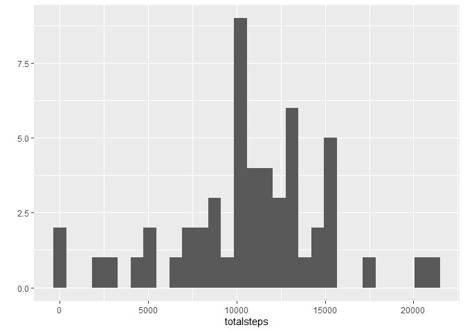
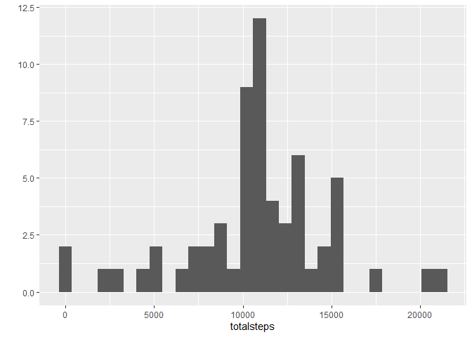
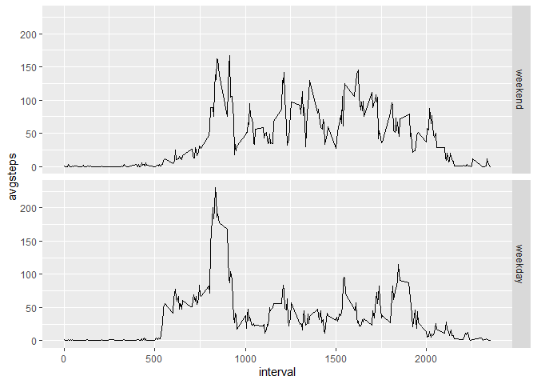

## Loading and preprocessing the data


```r
library(dplyr)
library(ggplot2)
library(tidyquant)

Activity <- read.csv("activity.csv")
Activity$date2 <- as.Date(Activity$date, "%Y-%m-%d")
```

## What is mean total number of steps taken per day?


```r
steps_perday <- Activity %>%
  group_by(date2) %>%
  summarise(totalsteps = sum(steps))

qplot(totalsteps, data=steps_perday)
```

<!-- -->


```r
cat("Mean of total steps: ", mean(steps_perday$totalsteps, na.rm=TRUE))
```

```
## Mean of total steps:  10766.19
```

```r
cat("Median of total steps: ", median(steps_perday$totalsteps, na.rm=TRUE))
```

```
## Median of total steps:  10765
```

## What is the average daily activity pattern?


```r
steps_perinterval <- Activity %>%
    group_by(interval) %>%
    summarise(avgsteps = mean(steps, na.rm=TRUE))

qplot(interval, avgsteps, data=steps_perinterval, geom=("line"))
```

<!-- -->


```r
sorted <- steps_perinterval %>%
    arrange(desc(avgsteps))
cat("5-minute interval contains the maximum number of steps: ", sorted[[1,1]])
```

```
## 5-minute interval contains the maximum number of steps:  835
```

## Imputing missing values


```r
cat("the total number of missing values in the dataset: ", sum(is.na(Activity$steps)))
```

```
## the total number of missing values in the dataset:  2304
```

The NA value is NA for all INTERVALs on a given day.
Therefore, it is the NA of the meadn/median number of steps for that day, and cannot be replaced by that value.
Therefore, I will replace the NA value with the average number of steps per corresponding INTERVAL for all days.


```r
fillin <- merge(Activity, steps_perinterval)
fillin$steps <- ifelse(is.na(fillin$steps), fillin$avgsteps, fillin$steps)

fillin_perday <- fillin %>%
    group_by(date2) %>%
    summarise(totalsteps = sum(steps))

qplot(totalsteps, data=fillin_perday)
```

<!-- -->

```r
cat("Mean of total steps: ", mean(fillin_perday$totalsteps, na.rm=TRUE))
```

```
## Mean of total steps:  10766.19
```

```r
cat("Median of total steps: ", median(fillin_perday$totalsteps, na.rm=TRUE))
```

```
## Median of total steps:  10766.19
```
The histogram was higher at the average frequency because the NA days now have an overall average value.
The overall mean remains the same.

## Are there differences in activity patterns between weekdays and weekends?

### Sorry, weekday strings are Japanese in my environment.


```r
weekdaystr <- c("月", "火", "水", "木", "金")
fillin$wDay <- factor((weekdays(fillin$date2, abbreviate = TRUE) %in% weekdaystr),
                      levels=c("FALSE", "TRUE"), labels = c("weekend", "weekday"))

fillin_perinterval <- fillin %>%
    group_by(interval, wDay) %>%
    summarise(avgsteps = mean(steps))

qplot(interval, avgsteps, data=fillin_perinterval, facets=wDay~., geom=c("line"))
```

<!-- -->
